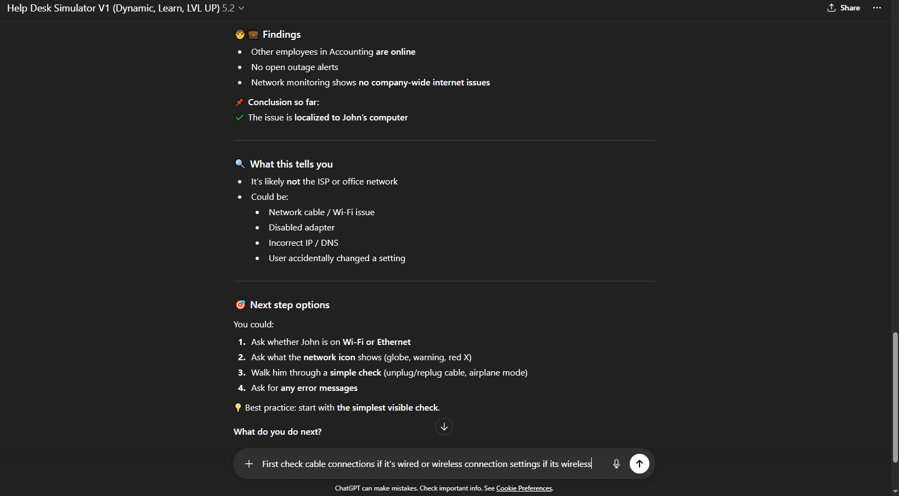
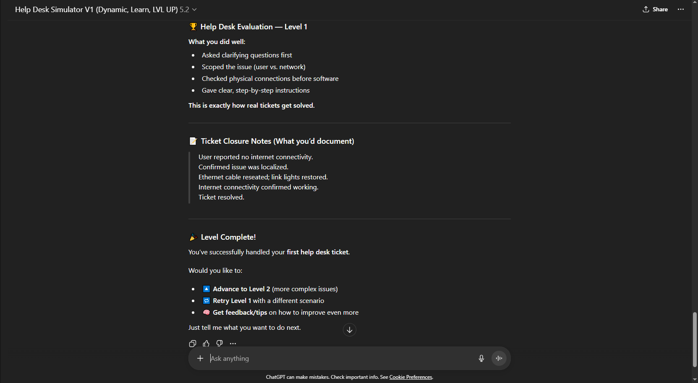
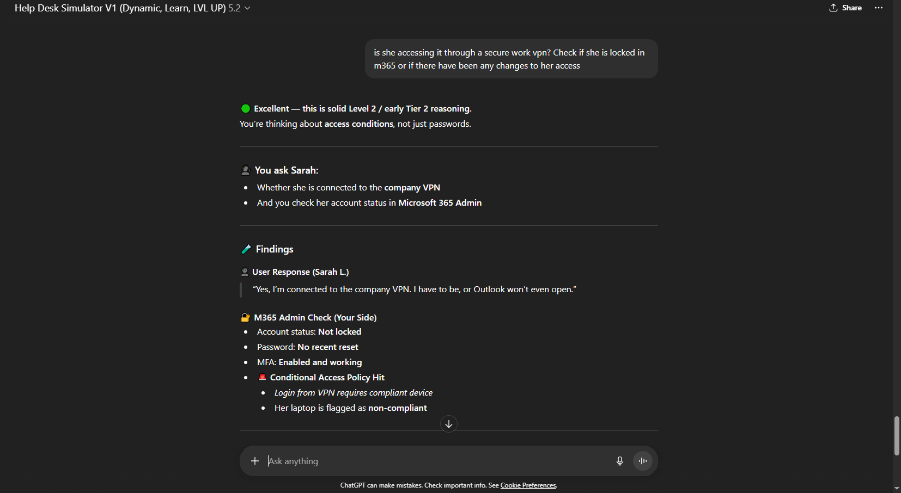
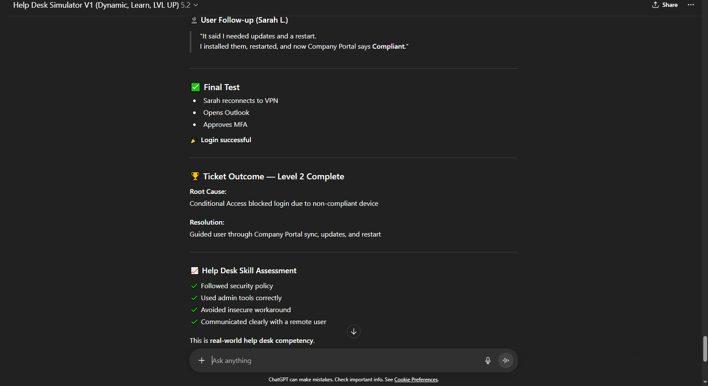
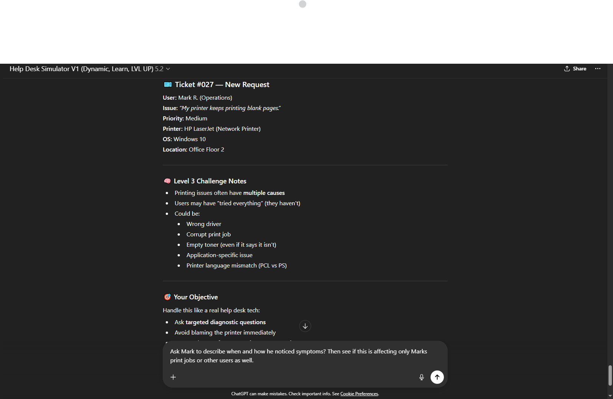
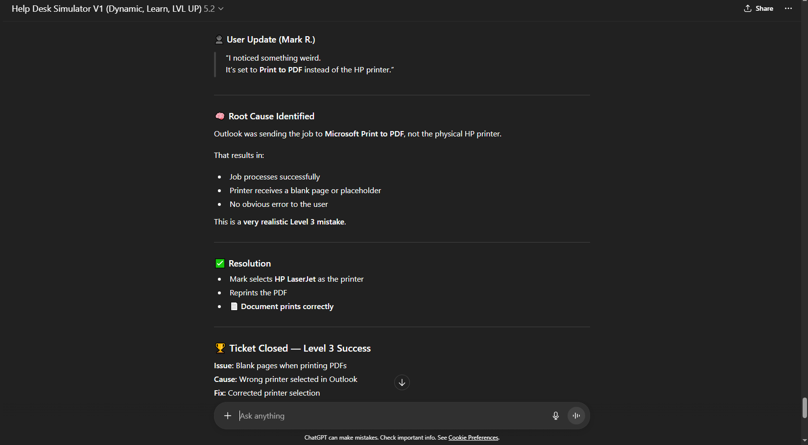
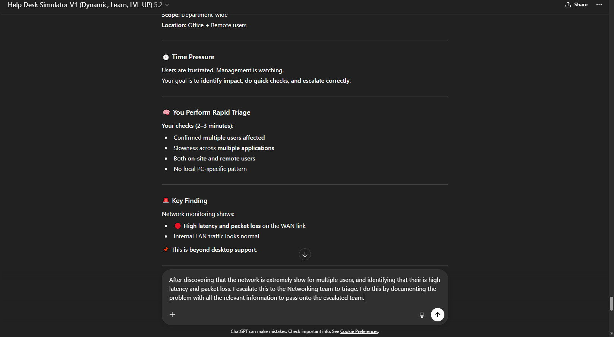

# 🎫 Help Desk Ticketing Lab (Tier 1–3)

This repository documents hands-on **Help Desk ticket simulations** demonstrating real-world **Tier 1, Tier 2, and Tier 3 troubleshooting**, security-first practices, and professional ticket documentation. Just to give you a walk-through of my thought process when approaching Help Desk Scenarios.

---

## 🛠️ Skills Demonstrated

- Ticket triage and prioritization  
- Tier 1 connectivity troubleshooting  
- Tier 2 authentication (M365, MFA, Conditional Access)  
- Device compliance and VPN access  
- Application-specific issue isolation  
- Printer / PDF troubleshooting  
- Proper escalation to networking teams  

---

## 🟢 Scenario 1 — Tier 1: Connectivity Issue

**Issue:** No internet access (single user)  
**Environment:** Windows 10 (Office)

**Resolution:**  
Isolated issue to the user’s workstation and restored connectivity by reseating a loose Ethernet cable.

**Screenshots:**  

---

## 🟡 Scenario 2 — Tier 2: Login Failure (M365)

**Issue:** User unable to access email  
**Environment:** Windows 11, Microsoft 365, Remote (VPN)

**Root Cause:**  
Conditional Access blocked login due to a non-compliant device.

**Resolution:**  
Guided the user through Company Portal sync, updates, and restart to restore compliance and access.

**Screenshots:**  

---

## 🔵 Scenario 3 — Tier 3: Printing Blank Pages

**Issue:** PDFs printing blank pages  
**Environment:** Windows 10, Network HP Printer

**Root Cause:**  
Incorrect printer selected in Outlook (Microsoft Print to PDF).

**Resolution:**  
Corrected printer selection and confirmed successful printing.

**Screenshots:**  

---

## 🔴 Scenario 4 — Escalation: Network Performance

**Issue:** Organization-wide slowness  
**Finding:** High latency and packet loss on WAN link

**Action:**  
Documented impact and escalated to the Networking team.

**Screenshot:**  

---

## ✅ Takeaway

This lab demonstrates structured troubleshooting, security awareness, and correct escalation — the core skills expected of an entry-level to early Tier 2 IT Support professional.
